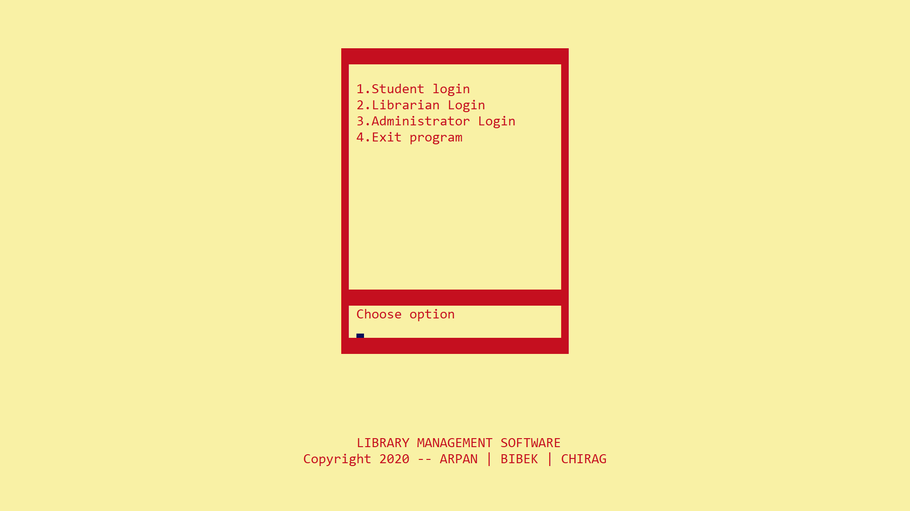
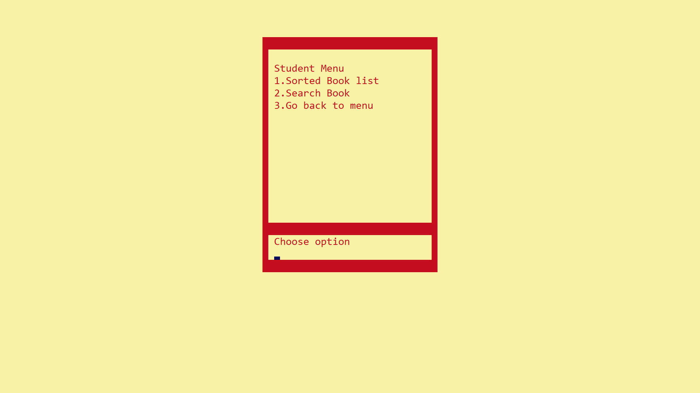
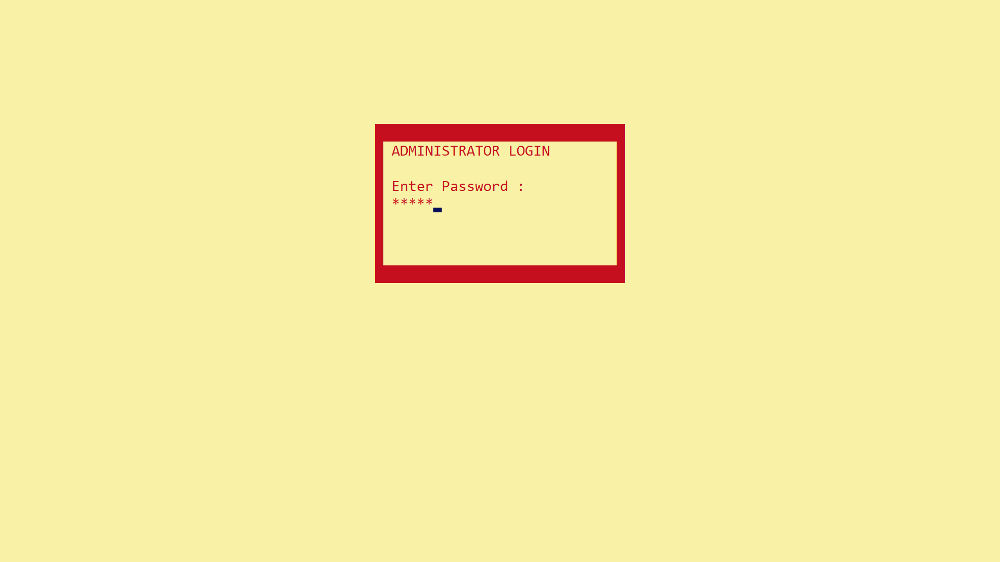
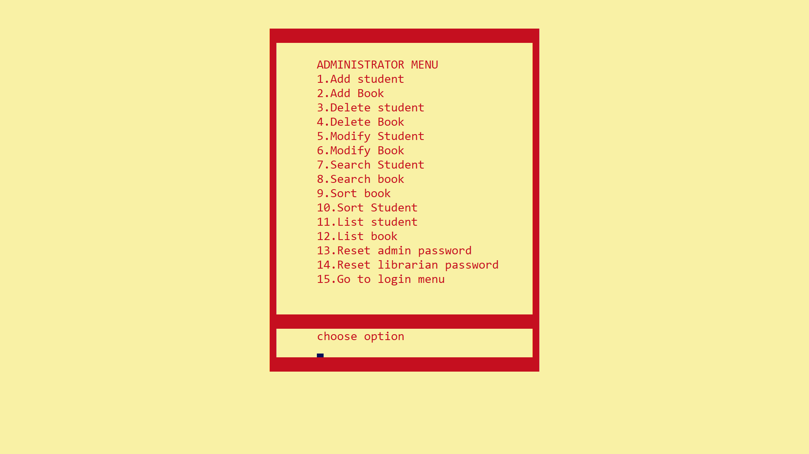
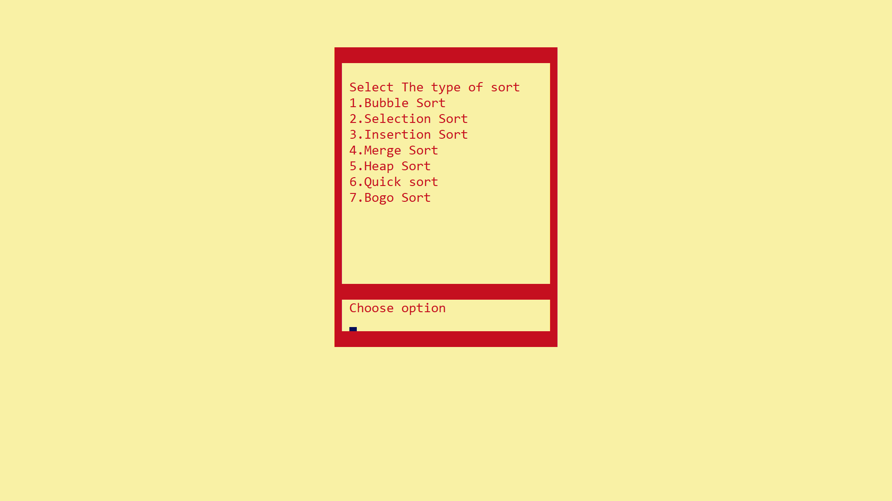
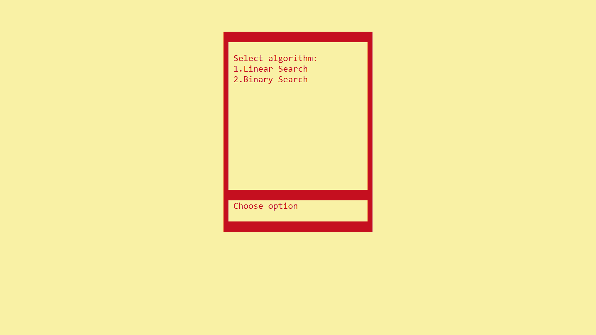

# E-Library LMS

**ELibrary LMS** is a **Library Management System** developed as a part of college project for IV Semester of Computer Engineering undergraduate program.

#### Project Members

-   **Arpan Pokhrel** (075BCT015)
-   **Bibek Basyal** (075BCT097)
-   **Chirag Lamsal** (075BCT032)

#### Project Preview

##### Splash Screen

##### Menu

##### Student Menu

##### Admin Login Screen

##### Admin Menu

##### Sorting Algorithms

##### Searching Algorithms

